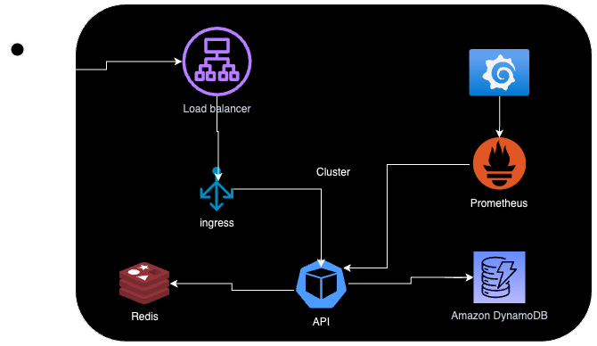

# URL Shortener API


The URL Shortener API enables users to shorten long URLs, generating a unique short identifier and redirecting to the original URL. Key functionalities include:

- Create Short Endpoint: Generates a unique identifier for a long URL.
- Redirection: Allows access to the original URL using the short identifier.
- URL Details: Retrieves information about a specific URL, including its status and original link.
- Toggle Status: Enables or disables a short URL, giving control over its accessibility.

### Solution

The architecture and infrastructure of this solution ensure a highly available, scalable API with simplified management and monitoring.
Each component was selected to support high traffic volumes, keeping the API efficient and stable and meeting the scalability, observability, and performance requirements of this challenge.



#### Pattern

The [Hexagonal Architecture](https://en.wikipedia.org/wiki/Hexagonal_architecture_(software)) in this project separates business logic from implementation details, creating a modular and maintainable system.
Here’s a concise overview of the directory structure and its purpose:
</br>

- cmd: Contains the entry point (main.go), responsible for initializing the application.
</br>

- internal

  adapter
    - driven: Adapters that implement interactions with databases, external services, etc., acting as dependencies for the core.
    - driver: Entry adapters, such as HTTP controllers, that interact with core use cases.


  core
  - domain: Contains core entities that represent business concepts.
  - port: Interfaces defining communication points between business logic and adapters.
  - usecase: Holds the main business logic and workflows of the system.

  dependency: Central configuration for dependency injection.

- pkg: Shared utilities like configuration, logger, web server, metrics, and error handling.

##### Advantages
This approach decouples business logic from technical details, ensuring extensibility, maintainability, and easy testing.
Hexagonal architecture supports adaptability by allowing changes in technology within adapters without affecting the core application.

#### Structure

```
├── Dockerfile
├── assets
│   └── docker
├── cmd
│   └── main.go
├── internal
│   ├── adapter
│   │   ├── driven
│   │   └── driver
│   ├── core
│   │   ├── domain
│   │   ├── port
│   │   └── usecase
│   └── dependency
│       └──dependency.go
└── pkg
    ├── config
    ├── customerror
    ├── helper
    ├── log
    ├── metric
    └── server
```

#### Why [Go](https://go.dev/)?

Go (Golang) was selected for developing the API due to its efficiency, simplicity, and performance.
It is a strong choice for backend services that require concurrency, low resource usage, and high scalability.

#### Storage and caching

- [DynamoDB](https://aws.amazon.com/es/dynamodb/)

  DynamoDB is used for persisting shortened URLs in a scalable, [serverless](https://es.wikipedia.org/wiki/Serverless_computing) environment.
  DynamoDB scales automatically and integrates well with other [AWS](https://aws.amazon.com/es/) services.

  - Comparison of [DynamoDB](https://aws.amazon.com/es/dynamodb/) and [PostgreSQL](https://www.postgresql.org/about/):

    - DynamoDB is ideal for [serverless](https://es.wikipedia.org/wiki/Serverless_computing), scalable data storage, particularly useful for high-speed [CRUD](https://en.wikipedia.org/wiki/Create,_read,_update_and_delete) operations on large data volumes, and integrates seamlessly with [AWS](https://aws.amazon.com/es/).
    - PostgreSQL, while providing [ACID](https://en.wikipedia.org/wiki/ACID) transactions and greater flexibility for complex queries, is less scalable without additional infrastructure.
    DynamoDB’s automatic scaling and [serverless](https://es.wikipedia.org/wiki/Serverless_computing) model align better with high-demand applications requiring minimal administration.
    - Cost and Scalability: DynamoDB proves more economical for [serverless](https://es.wikipedia.org/wiki/Serverless_computing) environments with straightforward access patterns.
    PostgreSQL would require added management and is less suited for a [serverless](https://es.wikipedia.org/wiki/Serverless_computing) architecture. 
  - Justification: Since the API primarily performs simple operations (saving and retrieving URLs) and benefits from [serverless](https://es.wikipedia.org/wiki/Serverless_computing) scalability, DynamoDB is the optimal choice.
  PostgreSQL would be more appropriate if relational complexity or [ACID](https://en.wikipedia.org/wiki/ACID) transactions were required, which is unnecessary in this context.


- [Redis](https://redis.io/) 

  Redis caches URLs temporarily to improve access speed.
  Redis enables rapid response times and reduces load on DynamoDB.

#### Observability and Monitoring

- [Prometheus](https://prometheus.io/)

  Prometheus collects API metrics, allowing monitoring of health, performance, and resource usage.

- [Grafana](https://grafana.com/)

  Grafana visualizes metrics, providing custom dashboards for real-time monitoring and trend analysis.

#### Infrastructure

 - [AWS EKS](https://docs.aws.amazon.com/es_es/eks/latest/userguide/what-is-eks.html) Deployment vs. [AWS Lambda](https://aws.amazon.com/es/pm/lambda/):

   The API is deployed on AWS EKS (Elastic Kubernetes Service), enabling efficient container management and automatic scaling.
   EKS was chosen because:

   - Scalability and Control: Kubernetes offers fine-grained autoscaling configurations and more flexibility than AWS Lambda for managing resources and advanced settings.
   - Container Compatibility: EKS facilitates container deployments and managing multiple services within a single cluster.
   - Cold Start in Lambda: AWS Lambda may experience a delay known as cold start when activated after being idle, which could negatively impact response times in an API that needs to handle traffic spikes reliably.
   - Cost Efficiency for Scaling: EKS is more cost-effective when steady processing power is required, with scalable autoscaling control.
 - Automatic Scaling

   The API CPU and memory-based autoscaling ensures resources scale automatically during traffic surges, efficiently handling high demand.
 - [CI/CD](https://es.wikipedia.org/wiki/CI/CD) with [GitHub Actions](https://github.com/features/actions)

   [GitHub Actions](https://github.com/features/actions) enables continuous integration and deployment ([CI/CD](https://es.wikipedia.org/wiki/CI/CD)), automating the building, testing, and deployment processes for the API, thus ensuring code integrity and reliability.

### Endpoints

You can import the endpoints from this [collection](assets/url-shortener.postman_collection.json) file
  
- Create URL

  Type: POST </br>
  Endpoint: urls </br>
  Description: Creates a new short URL from a provided long URL in the request body. </br>
  Request Body:
  ```json
  {
    "url": "https://example.com"
  }
  ```
  Response Code: 201 Created </br>
  Response: Returns the unique ID that represents the shortened URL. </br>
</br>

- Get URL Details

  Method: GET </br>
  Endpoint: urls/:shortID </br>
  Description: Returns details about a specific short URL, including its status (enabled/disabled) and the original URL. </br>
  Path Parameter: shortID (The unique identifier for the shortened URL). </br>
  Response Code: 200 OK or 404 Not Found if the shortID does not exist. </br>
</br>

- Redirect (Get Short URL)

  Method: GET </br>
  Endpoint: :shortID </br>
  Description: Redirects the user to the original URL associated with the specified shortID. </br>
  Path Parameter: shortID (The unique identifier for the shortened URL). </br>
  Response Code: 302 Moved Permanently (Redirects to the original URL) or 404 Not Found if the shortID does not exist. </br>
</br>

- Update URL
  
  Method: PUT
  Endpoint: :shortID </br>
  Description: Updates the original URL associated with an existing shortID. </br>
  Request Body: </br>
  ```json
  {
    "url": "https://example.com"
  }
  ```
  Path Parameter: shortID (The unique identifier for the shortened URL). </br>
  Response Code: 200 OK or 404 Not Found if the shortID does not exist.  </br>
</br>

- Toggle URL Status

  Method: PATCH  </br>
  Endpoint: :shortID  </br>
  Description: Changes the status of the short URL to either enabled or disabled.  </br>
  Request Body:  </br>
  ```json
  {
    "enabled": true
  }
  ```
  Path Parameter: shortID (The unique identifier for the shortened URL). </br>
  Response Code: 200 OK or 404 Not Found if the shortID does not exist. </br>
</br>

- Health Check

  Method: GET  </br>
  Endpoint: health  </br>
  Description: Checks the health status of the API.  </br>
  Response Code: 200 OK (if operational)  </br>
</br>

- Metrics

  Type: GET </br>
  Endpoint: metrics </br>
  Description: Exposes Prometheus metrics to monitor API performance and usage. </br>
  Response Code: 200 OK </br>
</br>

### Local environment

#### Services

You can use the required services using the [docker-compose](https://docs.docker.com/compose/intro/features-uses/#key-benefits-of-docker-compose) file

```shell
# cd assets/docker

docker-compose -p url-shortener-api up -d

```

#### Variables

We use [configuration](pkg/config/configyaml/config.yaml) in [YAML](https://yaml.org/) format.
This values are converted to a [Config](pkg/config/config.go) type.
This approach offers a controlled way to managed and validate all the variables before the app starts.


### Git Hooks

This project use some githooks to improve the code quality. Make sure to run below command to replace .git/hooks
by **.githooks/**

```shell
chmod ug+x .githooks/*
git config core.hooksPath .githooks
```

### [wire](https://github.com/google/wire)

Install wire for dependency injection management:

```shell
go install github.com/google/wire/cmd/wire@latest
```

use this script in the [dependencies](internal/dependency) directory:

```shell
wire
```

### [golangci-lint](https://golangci-lint.run/)

Please don't miss the opportunity to improve the code, install this linter before adding new commits

Homebrew:

```bash
brew install golangci-lint@1.61.0
```

Shell:

```bash
curl -sSfL https://raw.githubusercontent.com/golangci/golangci-lint/master/install.sh | sh -s -- -b $(go env GOPATH)/bin v1.61.0
```

Run:

```bash
golangci-lint run -v --fix
```


### [arch-go](https://github.com/fdaines/arch-go)

Install arch-go to run architecture unit test cases:

```shell
go install -v github.com/fdaines/arch-go@1.5.4
```

Then you can run below command to check the arch unit compliance:

```shell
arch-go
```

And off course you can contribute editing the [arch-go.yml](arch-go.yml) file

### Testing

To ensure robust and reliable code, the project uses [Ginkgo](https://github.com/onsi/ginkgo) for behavior-driven testing and [mockgen](https://github.com/golang/mock) for generating mocks. 

### [mockgen](https://github.com/golang/mock)

Install `mockgen` for mock generation:

```shell
go install github.com/golang/mock/mockgen@v1.6.0
```

Generate mocks the mockgen command, here there is an example:

```shell
mockgen -source=path/yourfile.go -destination=path/mock.go
```


### [Ginkgo](https://github.com/onsi/ginkgo)

Is a testing framework designed to write expressive specs.

To ensure that you will be able to run your tests follow this steps:

- System installation
  ```bash
  go install github.com/onsi/ginkgo/v2/ginkgo@latest
  ```
- Plugin installation
  [install the plugin](https://plugins.jetbrains.com/plugin/17554-ginkgo).
- Setup
  In the IDE setup configuration, add Ginko for all tests. <br/>
  

Run all tests:
```bash
ginkgo -v ./...
```
Or if you preffer the simple approach

This will run unit tests only:
```bash
go test -tags='!integration' ./...
```
This will include integration tests that require the services up and running:
```bash
go test ./...
```

### Load tests with [k6](https://grafana.com/docs/k6/latest/)

This project use k6 for load tests. 

```bash
brew install k6
```

There is two scripts for test the API in the [assets/tests](assets/tests) directory.
You can run the script by running:

```bash
k6 run get-test-simple.js
```

### Monitoring

This application expose metrics with [Prometheus](https://prometheus.io/) and use [Grafana](https://grafana.com/) to visualize them.

You can take a look to the metrics and data here:

- [Prometheus dashboard](http://prometheus-shortener.solucionesvaltech.com:9090/targets?search=)
- [Grafana dashboard](http://grafana-shortener.solucionesvaltech.com:3000/d/be20y741djqwwe/url-shortener?from=now-5m&to=now&timezone=browser&var-useCase=GETTING_URL)


### Production environment

You can use the Shortener API with this [URL](https://shortener.solucionesvaltech.com/).
The _solucionesvaltech.com_ domain it is just a personal domain.

#### Examples

- Creation
  ```bash
  curl --location 'https://shortener.solucionesvaltech.com/urls' \
  --header 'Content-Type: application/json' \
  --data '{
      "url": "https://es.wikipedia.org/wiki/Wikipedia:Portada"
  }'
  ```
- Resolve URL
  ```bash
  curl --location --request GET 'https://shortener.solucionesvaltech.com/JOr5DFWNR' \
  --header 'Content-Type: application/json' \
  ```

Made with 💛 by Víctor Valenzuela

